# SmartHome_AirQuality_Authentication

#### UseCase: SmartRoom_AirQuality with Authentication

The smart room set up established with zigbee2mqtt which acts as a gateway that connects the zigbee network to mqtt network and the interactions to the smart devices are operated from the fast API. For example, the interactions such as turning on/off the ventilator is based on the air quality in room.

The air quality data such as co2, humidity, and tempertaure is obtained with the scd-30 sensor for analysing the airquality and creating awareness with led notifications in case of higher co2 values in rooms and operate the ventilator with the smart room set up.

This version of API is deployed into NAS and can be accessed only from the institute network and with necessary username and passoword for authentication. The authentication is based on the access token that is valid only for 15 minutes and can be re-generated.  This version of api is used by the students for development purposes.

The url of the API deployed into NAS is https://airquality.se.jku.at/smartroomairquality/docs/

#### API

The digital twin represents the api that is created for performing the CRUD operations for the smart room devices based on the airquality.

The api is created using the fast api framework in Python. The digital twin api is set up with the [docker-compose.yaml file]('https://github.com/cdl-mint/SmartHomeOperations_AirQuality/SmartHome_AirQuality/blob/main/docker-compose.yaml').

#### Docker Installation

##### Pre-requisites:

In order to run the docker compose, the docker needs to be installed in the system.

##### Windows:

Install docker desktop on windows by following the´instructions provided in the [link]('https://docs.docker.com/desktop/install/windows-install/').

#### Deployment

After successful installation of the docker in your system, clone the repository and navigate to the project folder for running the docker-compose file with command.

`docker-compose up`

If the build is successful, you can see the services running on the ports as shown in table below. Navigate to the browser and check if the ports are running in localhost, for example the fastapi provides the graphical interface by default for performing the CRUD operations and can be viewed with the 'docs' path. The sample url for the air quality use case will be

'http://localhost:8002/docs'.

| services                        | port |
| ------------------------------- | ---- |
| fast_api (smartroom_airquality) | 8002 |
| grafana                         | 3001 |
| pgAdmin                         | 5055 |

#### Verifying the services:

##### PgAdmin- Set up the credentials:

Navigate to the browser url "http://localhost:5055", the pgAdmin interface will be visible and you can login into the pgAdmin with the following email id (pgadmin4@pgadmin.org) and password(admin).

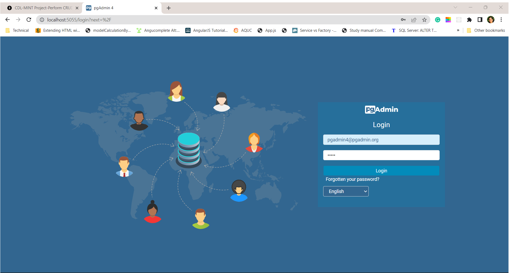

After successful login, add the new server by clicking on the add new server button.

Add a default host name and the database credentials based on the docker-compose.yaml configuration for the timeScaleDatabaseSRAQ container.

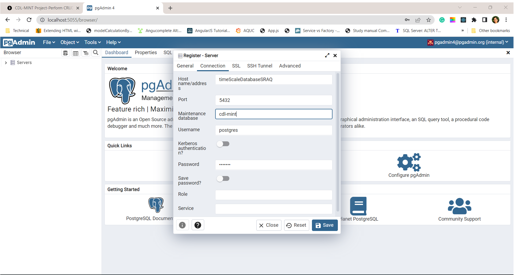

Now the tables will be created automatically based on the [database schema](https://github.com/cdl-mint/SmartHomeOperations_AirQuality/SmartHome_AirQuality/Database_Schema.sql) file as shown in figure. Navigate to the **cdl-mint** database and click on **Schemas-->public-->Tables** to view all the created tables.

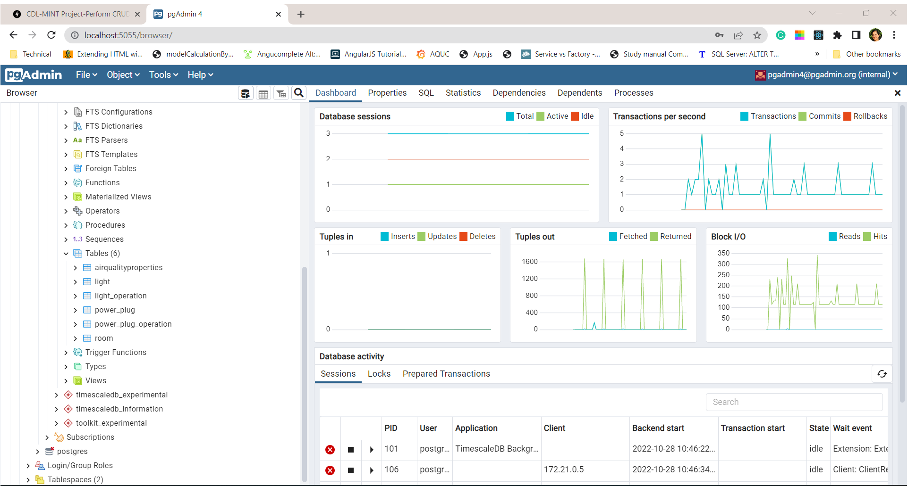

##### fast API:

Now we can use the fast API requests to perform CRUD operations on the created tables.

Navigate to the browser and check if the API is up and running from the port (8002) from localhost server.

The screenshots of the API are as follows :

fast API for the smart room_air quality use case:

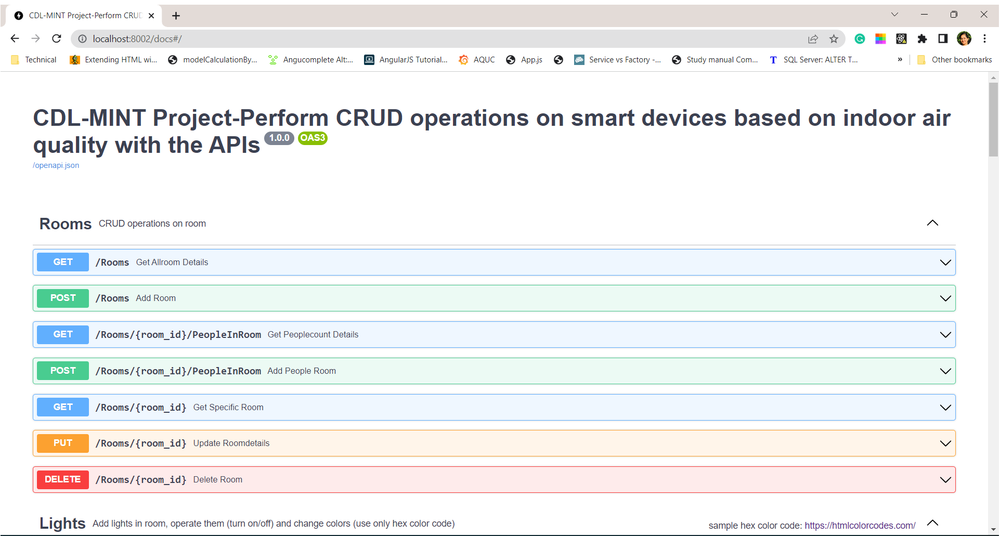

#### Sample POST Requests:

##### Room creation:

The air quality properties are analysed with respect to room, so the room need to be created first as the room id is the foreign key in the air quality properties table.

The room is created with the sample entry as shown in figure.

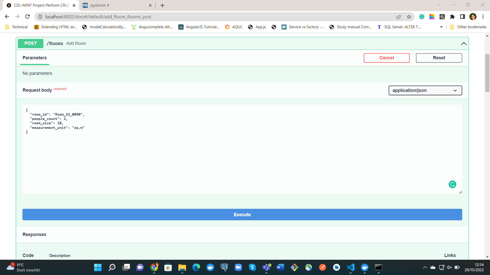

After entering the sample data, press the execute button, after the POST request is successful, you can see the success response with status 201, row is created in the room table in the timescale database.

Verify if the data entry is present in the room table as shown in figure.

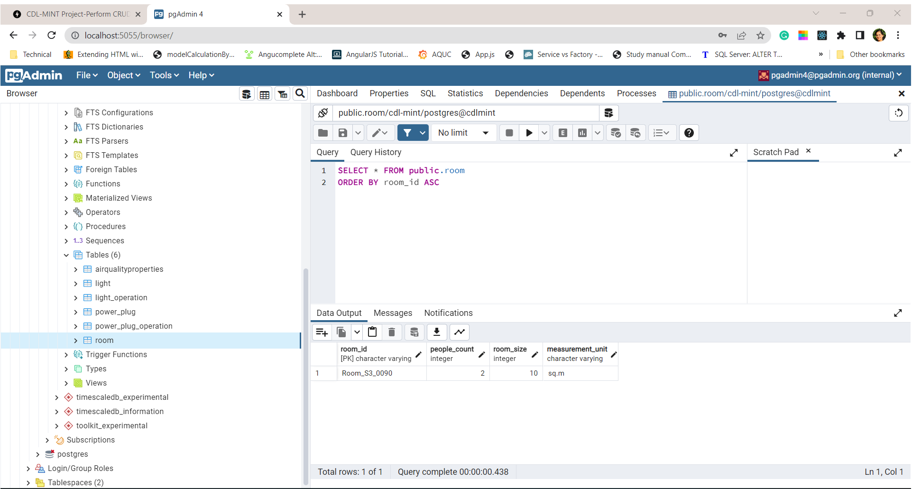

##### Air quality properties:

The sample air quality measurements for the room is shown in figure.

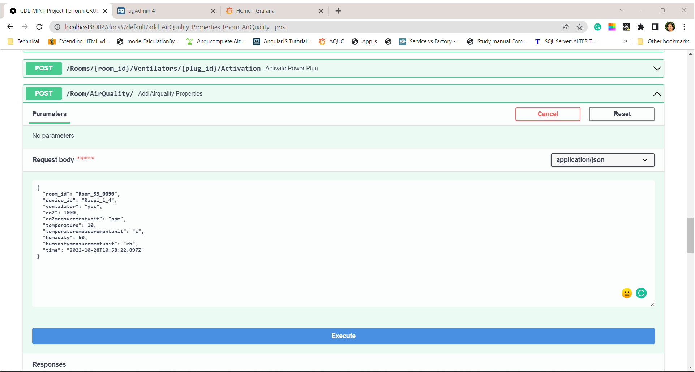

Verify if the data entry is present in the airqualityproperties table as shown in figure.

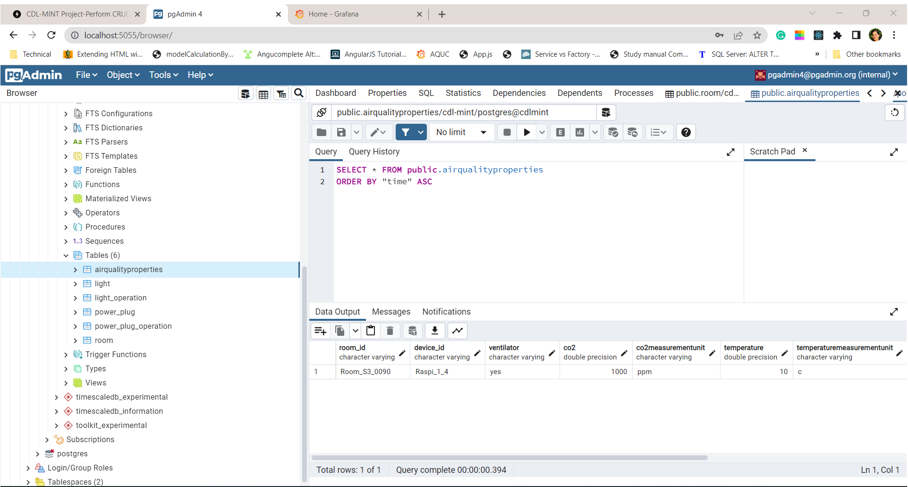

##### Grafana:

**Login**:

Navigate to the browser url "http://localhost:3001", the grafana interface will be visible and you can login with the default username and password as admin. Then change the passwod accordingly.

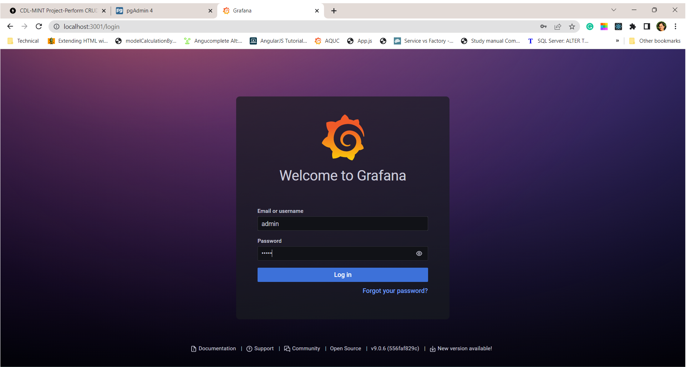

**Grafana- Data Sources:**

Integrate the postgresql database as the datasource for visualisation in grafana. You can create the new dashboard panel and also the add the data source for the panel.

Click on the configuration button and then the add data source button as shown in figure.

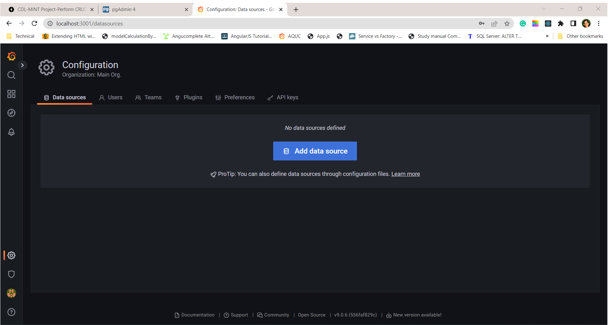

Search for the postgresql data source and select from the filtered options, there are also other data sources that can be used.

Add the data source credentials (database, username, and password) based on the docker-compose.yaml configuration, make sure that the host name matches the docker container name of the timescale data source. The host name is essential for the grafana to identify the data source in the server. Disbale the verification certification (TLS/SSL Mode). 

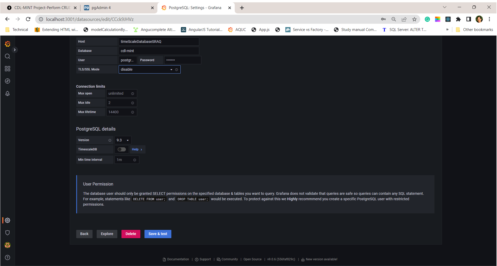

Test if the the database connection is successful as shown in figure.

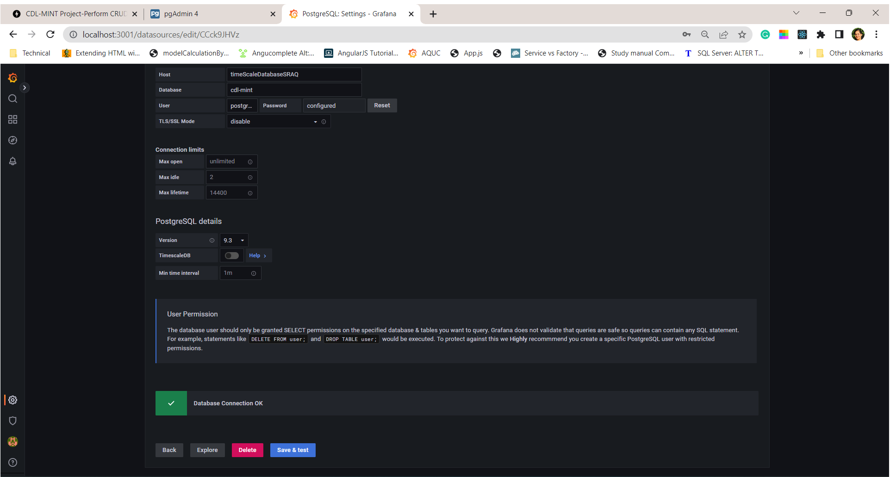

Add new panel from the menu and edit the properties for the panel. Set the title from panel options and edit panel settings. Add the query with table name and select column values co2,humidity, and temperature. The time column should contain the timeseries column of the database(i.e., time column). 

*The datetime column name should always be "time" in the database for visualizing the timeseries data in grafana.

The air quality measurements data can be visualised as shown in figure.

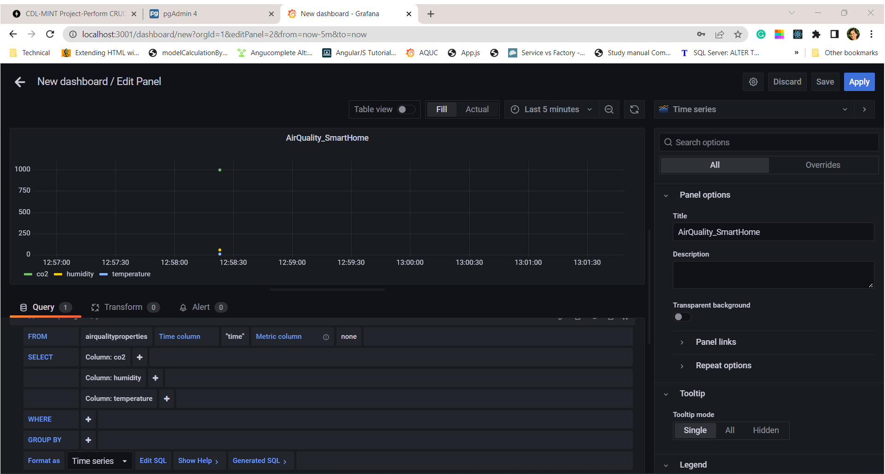
